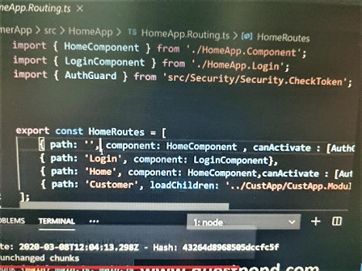

Arch capital services interview questions:

architectural difference between angular and angular.js: component vs controller style
do you prefer typescript or javascript

other interview questions:

. What is string interpolation: use of moustache syntaxi.e double curly braces

. how to generate class: ng generate class dummy

. Directives: Directives change behaviour of html dom eg: any angular variable 
    {{value}}, ngModel etc.

    component directive: Directive with template, eg: a user created component 
    which has html. Eg: a grid component <grid></grid>

    structual(ngIf, ngfor):change dom layout by adding or removing elements,

    attribute(ngStyle, [hidden]): change appearance/behaviour of html elements

. what is angular: its a ui binding framework

. How to implement lazy loading in angular

. what is typescript: superset of javascript. It adds types to javascript

. What is angular cli: it helps in creating boilerplate for project, component etc..

. what is module: group of components @NgModule

. what is decorator/annotations/metadata: tells what kind of class. eg: @component

. what are templates in angular: html view of angular

    eg: (({selector: "app-table", templateUrl: "./Table.component.html"}))

. What is data binding: how view and component communicate with each other is called data binding

. Different types of data binding:

    expression/interpolation: <td>{{customer}}</td> data flows from component to html

    property binding: [ngModel] component to view

    event binding: (ngModel) view to component

    2 way binding: [(ngModel)] view <> component

. Explain the architecture of angular:

    template: view of angular

    component(view talks to component) component talks with css, view

    module(groups the components logically)

    binding:[()] defines how view and component communicate

    directives: {{}} changes the html dom behaviour

    service: share common points/logic. when consumed into a component, the object is not created it is injected

    Dependency injection: to put services across components. helps to inject instance across constructor

. What is spa: load ui once and dont reload it again and again. To implement spa in angular we use angular routing. Routing helps in navigating b/w components. we need to define path and its component in routing.

    <router-outlet></router-outlet> here page will be loaded.

    [routerLink] helps in navigation

    this.route.navigate(['/Home']) helps navigation from behind view

.What is lazy loading: on demand loading. loading what is essential css html & js
    for this divide project into seperate modules and use loadChildren in router
    
    

    
continuation
